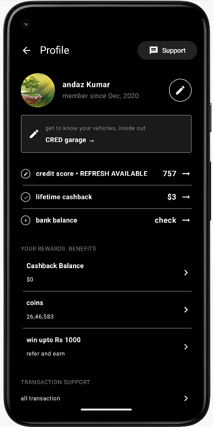

# Simple Profile UI using Jetpack Compose

Simple Profile UI using Jetpack Compose is a modern Android application that demonstrates how to create a clean and responsive user profile screen using Google's Jetpack Compose toolkit.

The app features a dark-themed layout with a top app bar, profile image, dynamic info sections, and customizable rewards and transaction UI components. It focuses on modular design using composable functions and aims to replicate real-world UI patterns similar to apps like CRED or finance trackers.

## 📸 Screenshot

